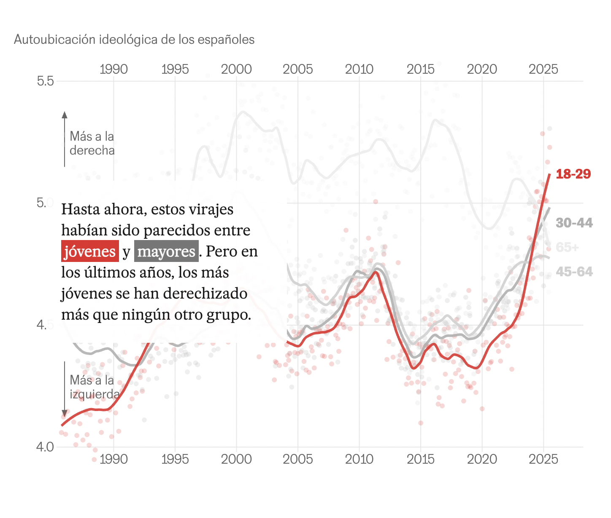
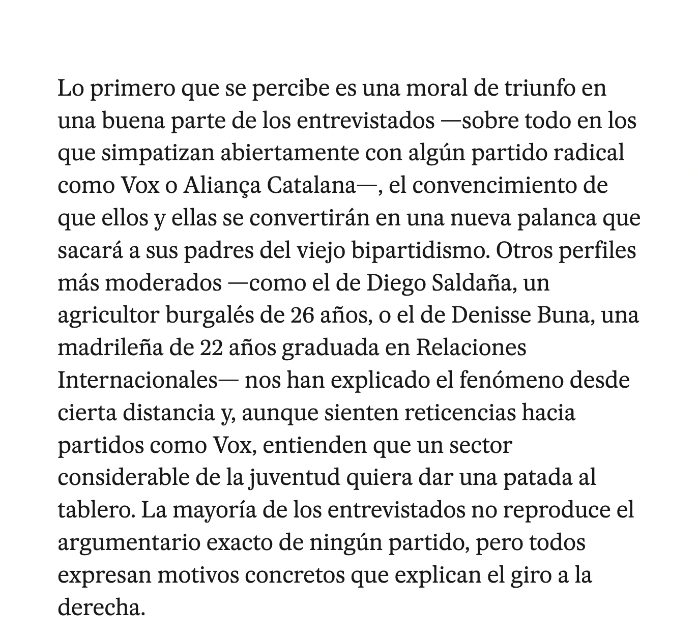
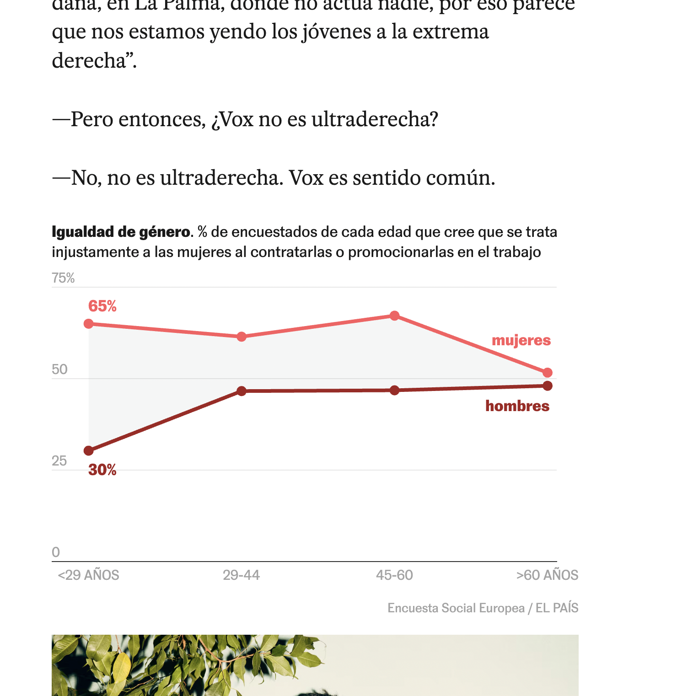

**análisis de: Los jóvenes son más de derechas que nunca. Estas son sus razones**

El artículo parte de un dato muy importante: los españoles de entre 18 y 29 años se ubican ideológicamente más a la derecha que nunca en los últimos 40 años y, por primera vez, se consideran más conservadores que el conjunto de la población española. Para entender este cambio, le preguntas a las personas y descubren que no existe una única explicación, las principales razones que se mencionan son: 

*La dificultad para acceder a una vivienda*: el 30% de los jóvenes considera la vivienda uno de los tres principales problemas del país. Además, desde 2018 el precio de la vivienda en España habría aumentado alrededor de un 50%.

+La inmigración*: Algunos jóvenes consideran que existe mucha inmigración irregular y la culpan de los problemas de inseguridad, el acceso a las ayudas sociales o la vivienda. Pero el reportaje no presenta estas afirmaciones simplemente como hechos, por ejemplo, cuestiona la idea de que los extranjeros reciben desproporcionadamente todas las ayudas sociales, con DATOS.

*Falta de oportunidades y precariedad*

*Desconfianza hacia la política tradicional*: Sienten que los partidos tradicionales no están solucionando sus problemas.

El atractivo de discursos más simples y radicales

Otro elemento interesante del reportaje es que nos dicen que alrededor del 80% de los jóvenes españoles utiliza las redes sociales para informarse, por encima de la televisión y otros medios. Esto permite que partidos y movimientos políticos lleguen directamente a los jóvenes mediante TikTok, Instagram, YouTube, etc., utilizando mensajes mucho más breves y fáciles de consumir. Al final, el artículo no solo plantea “los jóvenes se están volviendo de derecha”, sino que explica qué condiciones sociales y económicas están detrás de ese cambio y cómo los discursos políticos se "aprovechan" de eso.

Lo que me gustó de este texto es que mezcla opiniones, experiencias de vida y *DATOS*. 
El gráfico de arriba muestra, según años o edades, qué tan de derecha o de izquierda se han vuelto las personas en España, específicamente los jóvenes.

Además, mientras uno va bajando, el texto va cambiando sobre el mismo gráfico, haciéndolo bastante interactivo y fácil de entender, tiene colores, distintos tipos de letra y negritas.

Además, me gusta que, aunque partan con datos, no se queden solo en los gráficos, sino que también van agregando historias sacadas de entrevistas a personas que, según lo que dicen, van explicando los datos de los gráficos, haciéndolo aún más simple de entender al ver esos gráficos reflejados en personas reales, ya que además agregan imágenes de esas personas. 

Esta última imagen me pareció el gráfico más entretenido e interesante, ya que al ir tocando los puntitos en las líneas, te decía el rango de edad, porcentaje, y si son hombres y mujeres. Haz el texto libre de errores gramaticales y de ortografía en español. Además, convierte opiniones en datos como el porcentaje de encuestados que responde “mucho” o “bastante” a la afirmación "Hay demasiado machismo en la sociedad", lo cual hace más completo el texto, ya que no se centra solo en la percepción personal sobre ser de derecha, sino que agrega una percepción social de que las personas de derecha no consideran que exista demasiado machismo en la sociedad. 

Me parece que, gracias a todos los elementos, opiniones, gráficos y datos que tiene, es sumamente efectivo para transmitir información, que solo viendo los datos yo no entendería al 100%. Sin embargo, tiene un gran contra y es que para leerlo debes estar suscrito a El País, perooo, yo solo lo abro, desactivo el internet, lo cierro, lo vuelvo a abrir y activo el internet (así lo veo gratis y también funciona con La Tercera). 
Fuente: https://elpais.com/eps/2025-11-02/los-jovenes-son-mas-de-derechas-que-nunca-estas-son-sus-razones.html 